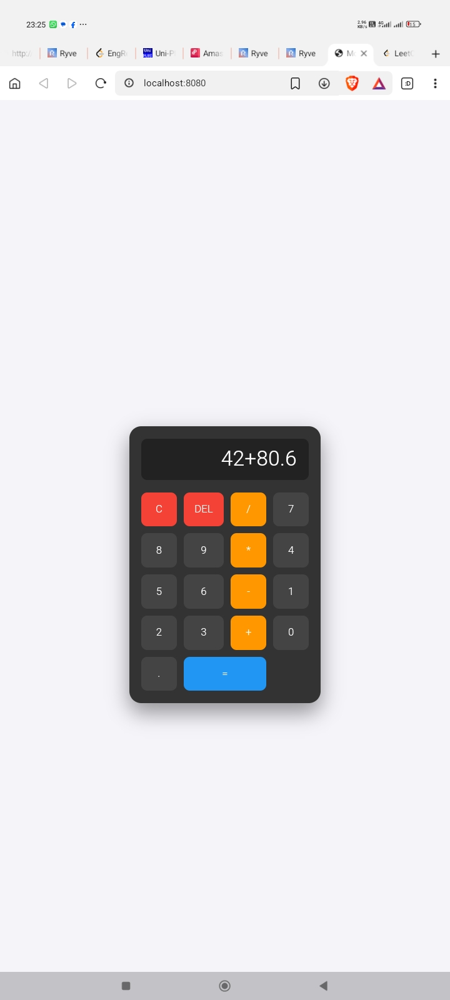

# 🧮 Modern Simple Calculator

A sleek, responsive, and functional web calculator built with Vanilla JavaScript, HTML5, and CSS3.

<table align="center">
  <tr>
    <td width="60%" valign="top">
      <h3>🚀 Project Overview</h3>
      <p>This project was built as a foundational milestone to master the basics of web development before transitioning to modern frameworks like <b>React</b> and <b>Vue.js</b>. It features a professional UI, tactile button feedback, and robust calculation logic.</p>
      <h3>✨ Key Features</h3>
      <ul>
        <li><b>Grid Layout:</b> 4-column button geometry using CSS Grid.</li>
        <li><b>Interactive UI:</b> Hover and active states for tactile feedback.</li>
        <li><b>Error Handling:</b> Integrated try-catch logic for math errors.</li>
      </ul>
    </td>
    <td width="40%" align="center">
      
      <br>
      <em>Live Preview</em>
    </td>
  </tr>
</table>

---
# 🛠️ Tech Stack

​HTML5: Semantic structure.

​CSS3: Custom properties, Grid, and Flexbox for centering.

​JavaScript ES6: DOM Manipulation and Event Listeners.

​# ⚙️ How to Run Locally

​Clone the repository:

git clone https://github.com/EngReteti/Simple-Calculator.git

​Navigate to the directory:

cd Simple-Calculator

​Open index.html in any browser.

# ​📝 Learning Journey

​This project marks the successful completion of my Vanilla JavaScript fundamentals. By building this from scratch, I have mastered event delegation, CSS positioning, and Git workflow. I used this space to build a simple calculator that features concepts in HTML, CSS, and JS. This has truly given me the basics I required and I'm now ready to start exploring frameworks like React & Vue.js.

# 📄 License
​
This project is licensed under the MIT License - see the LICENSE file for details.


If you find this project helpful, please leave a Star ⭐!

---
## 📁 Project Structure
```text
.
├── index.html           # Application Entry Point
├── LICENSE              # MIT License
├── .gitattributes       # Language Statistics Overrides
└── assets/
    ├── css/style.css    # Layout & Design
    ├── js/script.js     # Math Engine & Logic
    └── images/          # Project Screenshots

